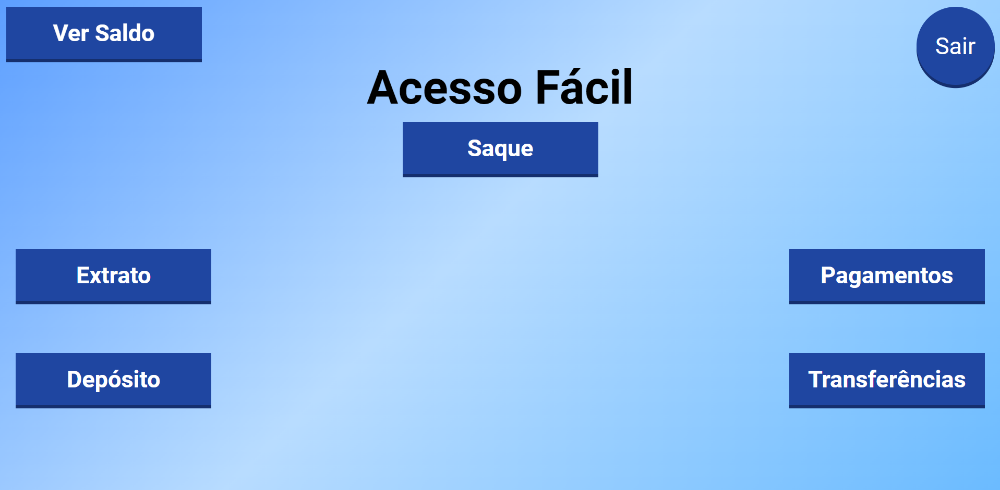

# Let Me Ask

> ATM Acesso Fácil é uma aplicação feita como TCC do curso de sistemas de informação do IFF, nesta aplicação foram utilizados conceitos de UX para a construção das interfaces. O intuito desta aplicação é facilitar o acesso do público idoso aos terminais de autoatendimento bancário. Ah, Foi utilizado biometria de reconhecimento facial :), ficou bom, vale a pena dar uma olhada!

## Site em produção
  Quem sabe faz ao vivo meu!
  
  [ATM-ACESSO-FÁCIL](https://acessofacil.netlify.app/login)

## 💻 Pré-requisitos

Antes de começar, verifique se você atendeu aos seguintes requisitos:
* Você possui uma `Webcam`?

## ☕ Usando ATM Acesso Fácil

Para usar, siga estas etapas:

* envie um e-mail para devsalim93@gmail.com ou me procure no [Linkedin](https://www.linkedin.com/in/devsalim/) para que eu possa te cadastrar no sistema, pois o sistema de reconhecimento facial, precisa de uma foto sua, então não esquece, me manda aquela foto sua do linkedin, aparecendo bem o seu rosto.
* Após enviar a foto, vou te responder enviando seus dados de acesso, e você vai poder explorar esse trabalho supimpa :-)
